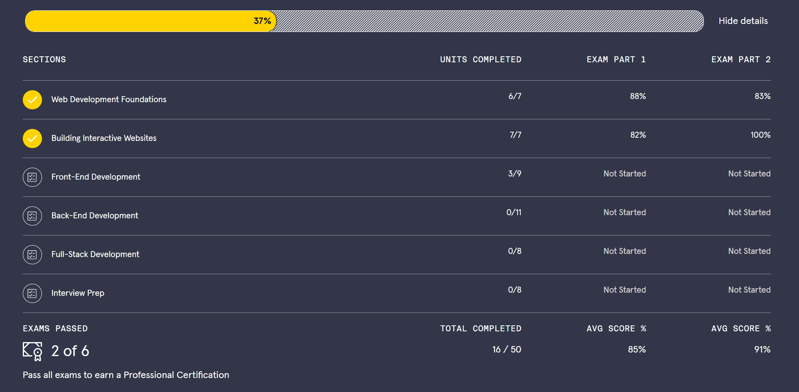

# Codecademy

As part of my learning, I have been completing Codecademy courses. My progress can be seen on my [Codecademy profile](https://www.codecademy.com/profiles/Stev1202).

Various parts of the courses set challenges, and as these have become more complex, I have decided to store the solutions in this repository. I've also included portfolio projects which are larger projects that give me implementation freedom and are an opportunity for me to apply what I've learned so far. 

My current progress on a large full-stack developer course is shown below (as at 17 May 2025). I have also received some certificates for completing a discrete git course.

## Certificates
* [Git & GitHub](https://www.codecademy.com/profiles/Stev1202/certificates/a8ab218d5950c29861635cc0bf12fd13)

## Challenges

* Web Development Foundations
    * [HTML Cheatsheet](https://github.com/stevhook/codecademy/tree/main/web-development-foundations/HTML-cheatsheet) - exploring & explaining colour referencing
    * [Build a Website Style Guide](https://github.com/stevhook/codecademy/tree/main/web-development-foundations/build-a-website-style-guide) - creating a style guide website
    * [Tea Cozy](https://github.com/stevhook/codecademy-challenges/tree/main/web-development-foundations/tea-cozy) - creating a website to specification
* Building Interactive Websites
    * [Mysterious Organism](https://github.com/stevhook/codecademy-challenges/tree/main/interactive-websites/mysterious-organism) - java functions
    * [Piano Keys](https://github.com/stevhook/codecademy-challenges/tree/main/interactive-websites/piano-keys) - java functions and DOM interaction
    * [Form-A-Story](https://github.com/stevhook/codecademy-challenges/tree/main/interactive-websites/form-a-story) - java functions and DOM interaction
* Front-end Development
  * [Build a Library](https://github.com/stevhook/codecademy-challenges/tree/main/front-end-development/build-a-library) - Class constructors
  * [School Catalogue](https://github.com/stevhook/codecademy-challenges/tree/main/front-end-development/school-catalogue) - Factory functions for classes 
  * [Factorial Feature](https://github.com/stevhook/codecademy-challenges/tree/main/front-end-development/factorial-feature)  - Test driven development implementing a factorial function and testing using mocha asserts.

## Portfolio projects

* [Soothsayer](https://github.com/stevhook/codecademy-challenges/tree/main/portfolio-projects/soothsayer) - A simple soothsaying function
* [Portfoilio website](https://github.com/stevhook/codecademy-challenges/tree/main/portfolio-projects/portfolio-website) - A website to showcase my progress so far, incorporating what I have learnt so far.

## Examination scripts
As I've progressed the examination components of the course have also started to involve writing more complex code. Which I have uploaded below.

* [Building Interactive Websites Exam Part 2](https://github.com/stevhook/codecademy-challenges/tree/main/examination-scripts/building-interactive-websites-exam-part-2)